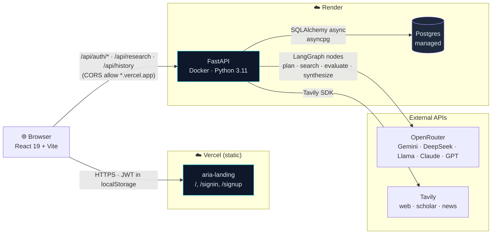
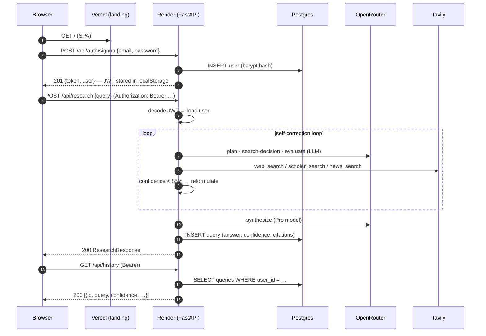
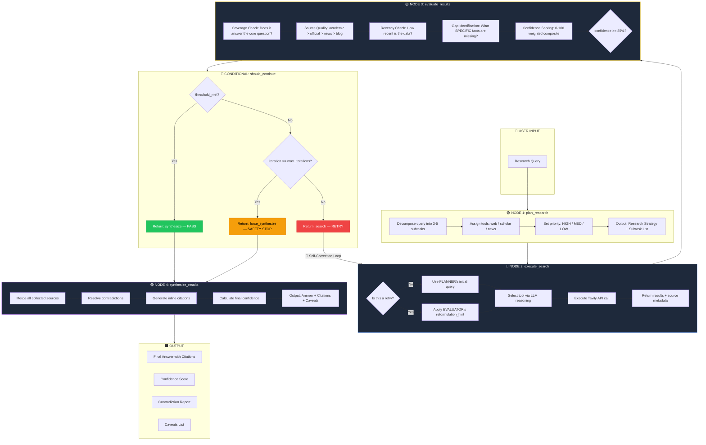
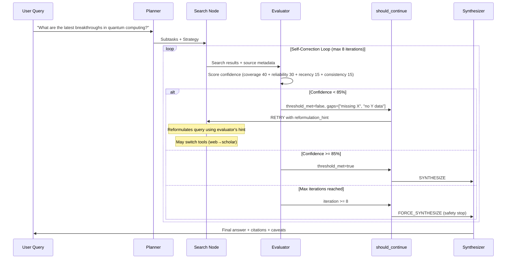

<p align="center">
  
  
  
  
  
  
</p>

# 🔬 ARIA — Autonomous Research Intelligence Agent

> A self-correcting, multi-tool research agent built on **LangGraph** that autonomously plans, searches, evaluates, and synthesizes information — retrying with reformulated strategies when confidence is insufficient.

**ARIA (codename: NEXUS)** implements a genuine **ReAct + Plan-and-Execute hybrid** pattern with **real self-correction**: the agent doesn't just retry — it *reasons about why it failed*, identifies specific knowledge gaps, and reformulates its search strategy accordingly.

This repo is the **full-stack build**: self-correcting LangGraph agent, FastAPI backend with JWT auth + Postgres, SSE streaming, pytest + GitHub Actions CI, and a one-click Render deploy.

---

| Resource | Link |
|----------|------|
| 📂 **Backend repo** | [github.com/RagavRida/research-agent](https://github.com/RagavRida/research-agent) |
| 🎨 **Landing repo** | [github.com/RagavRida/aria-landing](https://github.com/RagavRida/aria-landing) |
| 🌐 **Landing (prod)** | https://aria-landing-one.vercel.app |
| 🔌 **API (prod)** | https://research-agent-production-d1bb.up.railway.app (`/docs` for OpenAPI) — Docker on Railway |
| 📊 **Agent trace** | [`agent_trace.json`](./agent_trace.json) — real SSE capture from a research run |
| 🚀 **Deploy your own** | [Render blueprint](https://render.com/deploy?repo=https://github.com/RagavRida/research-agent) |

---

## 🏗️ System Architecture

Top-level components and the wire between them. The **browser** only ever talks
to Vercel (the landing) and Render (the API). Secrets never cross into the
browser; Postgres, OpenRouter, and Tavily are backend-only.



### Request flow — signup → research → history



---

## 📐 Agent Architecture (internal LangGraph loop)



### Self-Correction Data Flow



---

## 🧩 Tech Stack

| Layer | Technology | Purpose |
|-------|-----------|---------|
| **Agent Framework** | LangGraph (StateGraph) | Stateful directed graph with conditional edges |
| **LLM — provider** | OpenRouter / Gemini / Groq (hot-swappable) | Single API key via OpenRouter; or direct Gemini/Groq |
| **LLM — Fast** | `gemini-2.0-flash-exp` / `llama-3.1-8b-instant` | Planning, search decisions, evaluation |
| **LLM — Pro** | `deepseek-chat-v3.1` / `llama-3.3-70b-versatile` / `gemini-1.5-pro` | Final synthesis (long-context) |
| **Search Tools** | Tavily API | Web search, scholar search, news search |
| **Backend** | FastAPI 0.115 + Uvicorn | SSE streaming + REST |
| **Auth** | JWT (python-jose) + bcrypt | Email + password, 7-day tokens |
| **Database** | SQLAlchemy 2.0 async + asyncpg / aiosqlite | Postgres in prod, SQLite in dev |
| **Frontend** | React 19 + Vite 6 + TypeScript + Tailwind v4 | Landing + auth + live thinking log |
| **State Management** | LangGraph TypedDict | 25+ typed fields with append-only accumulators |
| **Logging** | structlog (JSON) | Structured event logging throughout pipeline |
| **Testing** | pytest + pytest-asyncio + httpx.TestClient | 12 tests, fresh in-memory DB per case |
| **CI/CD** | GitHub Actions → Render (Docker) + Vercel | Auto-deploy on push to `main` |

---

## 📖 Prompt Library

### 1. Master System Prompt

**Used in:** Every LLM call (injected as `SystemMessage`)

```
You are NEXUS, an autonomous research agent using ReAct reasoning.
You have access to web_search, scholar_search, and news_search tools.

STRICT RULES:
1. Always respond in valid JSON matching the schema provided.
2. Never fabricate URLs, statistics, or author names.
3. Every factual claim must map to a retrieved source.
4. If confidence < {confidence_threshold}%, you MUST retry with a different query.
5. Maximum {max_iterations} iterations — then synthesize best available.
6. Flag unverified claims with [UNVERIFIED] tag.
7. When sources contradict, present both views.

REASONING FORMAT:
- thinking: your internal chain-of-thought (2-4 sentences)
- action: what you are about to do
- data: structured output for this step type
```

**Design rationale:** The system prompt enforces the ReAct `(thinking → action → data)` format as a structural contract. Rule 2 ("Never fabricate URLs") directly combats hallucination. Rule 4 establishes the self-correction trigger. Rule 7 prevents the agent from silently choosing one side of a contradiction — forcing explicit disclosure.

---

### 2. Planner Prompt

**Used in:** `plan_research` node (Node 1)  
**Temperature:** `0.3` (low — we want structured, deterministic decomposition)

```
Given this research query: {query}

Break it into 3-5 specific, searchable subtasks using Chain-of-Thought reasoning.

Think step by step:
1. What are the core components of this question?
2. What specific facts need to be found?
3. What's the right search order (broad → specific)?
4. Which tool fits each subtask best?
```

**Output schema:** `{ thinking, action, data: { subtasks: [{ id, task, priority, tool, search_query }], strategy, expected_challenges } }`

**Temperature choice (0.3):** Research decomposition requires structured, predictable output. A higher temperature (0.7+) would introduce unnecessary creativity in task breakdown, potentially generating ambiguous subtasks. The slight deviation from 0.0 allows minor variation in phrasing while maintaining consistent structure.

---

### 3. Search Decision Prompt V2 (Retry-Aware)

**Used in:** `execute_search` node (Node 2)  
**Temperature:** `0.3`

```
You are the SEARCH node of an autonomous research agent.
Decide the next search query to execute.

Original research query: {query}
Current iteration: {iteration} of {max_iterations}
Is this a retry after failed evaluation: {is_retry}
Previous queries used (DO NOT repeat these): {previous_queries}
Cumulative information gaps: {gaps}
Current confidence level: {confidence}%
Evaluator's reformulation hint: {reformulation_hint}

If this is a RETRY (iteration > 1):
  - You MUST follow the reformulation hint from the evaluator
  - Your new query must be MEANINGFULLY different from all previous queries
  - Target the specific gaps listed above
  - Consider switching tools: if web_search failed, try scholar_search

Query construction rules:
  - Under 10 words (search engines prefer concise queries)
  - Include specific entities (years, organizations, metrics)
  - No filler words
```

**Output schema:** `{ thinking, action, data: { query, tool, reason, targets_gap, reformulation_strategy, expected_return, is_retry, confidence_before } }`

**Design rationale:** This prompt is the core of the self-correction mechanism. The key design decision is injecting the evaluator's `reformulation_hint` directly into the search node's context — creating a **closed feedback loop** where the evaluator *tells* the search node exactly how to change its strategy. The explicit `DO NOT repeat these: {previous_queries}` instruction prevents query cycling. The `reformulation_strategy` enum (`broader|narrower|adjacent|source_targeted`) forces the agent to articulate *why* the new query differs.

---

### 4. Evaluator Prompt V2 (Self-Correction Trigger)

**Used in:** `evaluate_results` node (Node 3)  
**Temperature:** `0.3`

```
Step 1 — Coverage Check:
  Does this result DIRECTLY answer the core research question?

Step 2 — Source Quality Check:
  Are sources academic, official, or just blogs?

Step 3 — Gap Identification:
  What SPECIFIC facts are still missing?
  Not "more data needed" but "no sector-specific breakdown for healthcare"

Step 4 — Confidence Scoring:
  Score 0-100 based on:
  - Coverage of core question: 40 points max
  - Source reliability: 30 points max
  - Recency of data: 15 points max
  - Consistency across sources: 15 points max

Step 5 — Reformulation Strategy (ONLY if retrying):
  If confidence < threshold, decide HOW to search differently
```

**Output schema:** `{ thinking, action, data: { confidence, sources_found, avg_reliability, threshold_met, decision, coverage_score, reliability_score, recency_score, consistency_score, gaps_identified, what_was_found, reformulation_hint, reformulation_strategy, retry_urgency } }`

**Temperature choice (0.3):** The evaluator must be **honest, not creative**. A temperature of 0.0 would be deterministic but might cause the model to get stuck in repetitive confidence patterns. 0.3 allows slight variation in gap identification while keeping scoring consistent. The explicit instruction "Be honest. Overconfidence defeats the purpose." is critical — without it, smaller models tend to inflate confidence scores.

---

### 5. Synthesizer Prompt

**Used in:** `synthesize_results` node (Node 4)  
**Temperature:** `0.2` (Pro model — we want factual precision with minimal hallucination)

```
You are synthesizing research findings into a comprehensive answer.

Tasks:
1. Merge all relevant information
2. Identify and explicitly resolve contradictions
3. Calculate final confidence based on source quality + coverage
4. Generate proper citations
5. Note important caveats
```

**Output schema:** `{ thinking, action, data: { contradictions: [{claim_a, claim_b, resolution, weight}], final_confidence, key_findings, sources_used, answer, citations: [{id, url, title, reliability}], caveats } }`

**Temperature choice (0.2):** The Pro model handles synthesis with the lowest temperature. Synthesis must be maximally faithful to retrieved sources. A 0.2 temperature prevents verbatim repetition while minimizing the risk of the model "filling in" facts not present in the source material.

---

### Tool Definitions

The agent has access to three search tools, dynamically selected per-iteration:

| Tool | Tavily Parameters | Use Case |
|------|------------------|----------|
| `web_search` | `search_depth="advanced"`, `max_results=8` | General web coverage, baseline understanding |
| `scholar_search` | Site-filtered: arXiv, PubMed, JSTOR, Semantic Scholar | Academic sources, peer-reviewed research |
| `news_search` | `topic="news"`, `days=90`, `max_results=6` | Recent developments, last 90 days |

Each tool classifies sources via `classify_source_type()` into: **academic → official → news → web** (reliability hierarchy).

---

## 🧠 Logic Explanation: Why This Agentic Pattern?

### Pattern: ReAct + Plan-and-Execute Hybrid with Closed-Loop Self-Correction

ARIA uses a hybrid of two established patterns:

1. **Plan-and-Execute** (Node 1): Decomposes the query into subtasks before execution. This prevents the agent from immediately searching the raw query — which often yields shallow results.

2. **ReAct** (Nodes 2-3): Each search and evaluation step follows the `(thinking → action → observation)` cycle, with explicit chain-of-thought reasoning logged at every step.

3. **Closed-Loop Self-Correction** (the critical addition): Unlike basic ReAct, the evaluator doesn't just say "not good enough." It produces a **specific reformulation hint** that the search node must follow. This creates a genuine feedback loop:

```
Evaluator: "Confidence 35%. Missing: no post-2023 statistics. 
            Reformulation: narrower — target '2024 statistics' specifically."
    ↓
Search: "Applying reformulation hint. Switching to scholar_search.
         New query: 'quantum computing milestones 2024 statistics'"
    ↓
Evaluator: "Confidence 72%. Still missing: sector-specific breakdowns.
            Reformulation: adjacent — try industry analysis."
```

### Why Not Pure ReAct?

Pure ReAct agents choose their next action freely, which leads to:
- **Query cycling**: Repeating the same or similar queries
- **Tool fixation**: Always using `web_search` even when `scholar_search` would be better
- **Over-exploration**: No mechanism to converge toward an answer

ARIA's evaluator-driven retry loop solves all three: it forces different queries (via `previous_queries` tracking), suggests tool switching, and converges via confidence scoring.

### Why Not Pure Plan-and-Execute?

Plan-and-Execute creates a fixed plan upfront and executes it sequentially. This fails for research because:
- **Information is discovered iteratively** — what you find in search 1 should influence search 2
- **No quality gate** — all tasks execute even if early results are sufficient
- **No recovery** — if one search path fails, the plan doesn't adapt

ARIA's confidence-gated loop allows the plan to be de-prioritized once the evaluator determines sufficient coverage.

---

## 🚀 Quick Start

### 1. Backend (FastAPI + SQLite dev DB)

```bash
cd research_agent
cp .env.example .env                 # fill OPENROUTER_API_KEY + TAVILY_API_KEY
python3 -m venv .venv && source .venv/bin/activate
pip install -r requirements.txt
python3 main.py                      # → http://localhost:8000 (docs at /docs)
```

First boot auto-creates `aria.db` (SQLite) and the `users` table. For Postgres
in prod, set `DATABASE_URL=postgresql://...` — the driver is normalised
automatically.

### 2. Frontend — landing (Vite)

Landing lives in [its own repo](https://github.com/RagavRida/aria-landing):

```bash
git clone https://github.com/RagavRida/aria-landing
cd aria-landing
npm install
echo "VITE_API_BASE_URL=http://localhost:8000" > .env
npm run dev                          # → http://localhost:3000
```

### 3. Frontend — research app (existing `aria/` folder)

```bash
cd aria
npm install
npm run dev                          # → http://localhost:5173
```

### Environment variables

All backend config lives in `research_agent/.env`. Full table:

| Variable | Required | Default | Notes |
|----------|----------|---------|-------|
| `TAVILY_API_KEY` | ✅ | — | Powers web/scholar/news search. Free 1k/mo at tavily.com |
| `LLM_PROVIDER` | ✅ | `openrouter` | One of `openrouter` \| `gemini` \| `groq` |
| `OPENROUTER_API_KEY` | if provider=openrouter | — | Single key for Gemini/DeepSeek/Llama/Claude/GPT |
| `OPENROUTER_MODEL_FAST` | optional | `google/gemini-2.0-flash-exp:free` | Fast-path model |
| `OPENROUTER_MODEL_PRO` | optional | `deepseek/deepseek-chat-v3.1:free` | Synthesis model |
| `GOOGLE_API_KEY` | if provider=gemini | — | From aistudio.google.com/apikey |
| `GROQ_API_KEY` | if provider=groq | — | From console.groq.com |
| `DATABASE_URL` | ✅ | `sqlite+aiosqlite:///./aria.db` | Postgres: `postgresql://…` auto-normalised |
| `JWT_SECRET` | ✅ | `change-me-in-production` | Long random string in prod |
| `JWT_ALGORITHM` | optional | `HS256` | |
| `JWT_EXPIRES_MINUTES` | optional | `10080` | 7 days |
| `PORT` | optional | `8000` | |

---

## 🔐 Auth & Database

Three endpoints sit under `/api/auth/*`:

| Method | Path | Body | Success | Errors |
|--------|------|------|---------|--------|
| POST | `/api/auth/signup` | `{email, password, name?}` | `201 {token, user}` | `409` duplicate email, `422` short password |
| POST | `/api/auth/signin` | `{email, password}` | `200 {token, user}` | `401` bad credentials |
| GET  | `/api/auth/me` | — (Bearer token) | `200 {id, email, name}` | `401` missing/invalid token |

Passwords are bcrypt-hashed; emails are lower-cased on signup (so `Ada@X.com`
and `ada@x.com` are the same account). JWTs are HS256, expire in 7 days by
default, and carry the user UUID as `sub`.

```bash
# end-to-end smoke
curl -sX POST localhost:8000/api/auth/signup -H 'Content-Type: application/json' \
  -d '{"email":"ada@example.com","password":"supersecret1","name":"Ada"}'
# → {"token":"eyJ…","user":{"id":"…","email":"ada@example.com","name":"Ada"}}

curl -sX GET localhost:8000/api/auth/me -H "Authorization: Bearer $TOKEN"
```

---

## 🧪 Testing

```bash
cd research_agent
pytest -q
```

`tests/conftest.py` spins up a fresh in-memory SQLite DB and reloaded app per
test, so JWT + bcrypt + SQLAlchemy are exercised end-to-end with zero shared
state. Current coverage:

- `test_auth.py` — 10 cases (signup 201/409/422, signin 200/401×2, me 401×2/200, email case-norm)
- `test_health.py` — health + agent config smoke

Runs in ~3s; CI does the same on every push to `main` (`.github/workflows/ci.yml`).

---

## ☁️ Deploy

### Backend → Render (one click)

[](https://render.com/deploy?repo=https://github.com/RagavRida/research-agent)

The [`render.yaml`](./render.yaml) blueprint provisions:
- `aria-db` — managed Postgres (free plan)
- `research-agent-api` — Docker web service with healthcheck at `/api/health`
- Auto-generated `JWT_SECRET`
- `DATABASE_URL` wired from the DB's connection string
- Prompts once for `OPENROUTER_API_KEY` + `TAVILY_API_KEY`

Render auto-deploys on every push to `main`.

### Frontend → Vercel

```bash
cd aria-landing
vercel --prod
# then set VITE_API_BASE_URL to your Render URL in the Vercel dashboard
```

CORS on the backend already accepts any `*.vercel.app` subdomain via
`allow_origin_regex`, so preview URLs work without config changes.

---

## 📁 Project Structure

```
research-agent/
├── research_agent/
│   ├── main.py                 # FastAPI app entry + startup DB init
│   ├── config.py               # Pydantic settings (env vars, thresholds, JWT, DB)
│   ├── Dockerfile              # python:3.11-slim → uvicorn
│   ├── pytest.ini              # asyncio_mode=auto
│   ├── agent/
│   │   ├── state.py            # AgentState TypedDict (25+ fields)
│   │   ├── graph.py            # LangGraph StateGraph definition
│   │   ├── nodes.py            # 4 node functions + self-correction logic + LLM init
│   │   ├── prompts.py          # 5 prompt templates
│   │   └── tools.py            # 3 Tavily search tools + source classifier
│   ├── api/
│   │   ├── routes.py           # /api/research, SSE stream, model switch
│   │   ├── auth_routes.py      # /api/auth/signup, /signin, /me
│   │   └── schemas.py          # Pydantic request/response models
│   ├── db/
│   │   ├── database.py         # Async SQLA engine + session dep + URL normaliser
│   │   └── models/user.py      # User table (id, email, name, password_hash, created_at)
│   ├── services/
│   │   ├── auth.py             # bcrypt hash, JWT mint/verify, get_current_user dep
│   │   └── logger.py           # Structured logging
│   └── tests/                  # pytest — 12 cases, fresh DB per test
│       ├── conftest.py
│       ├── test_auth.py
│       └── test_health.py
├── aria/                       # React research-app frontend (existing)
├── .github/workflows/ci.yml    # pytest on every push/PR
├── render.yaml                 # Render blueprint (Postgres + web service)
├── agent_trace.json            # Real 27-event SSE capture from one run
└── README.md
```

> The **landing page** lives in a separate repo:
> [`RagavRida/aria-landing`](https://github.com/RagavRida/aria-landing) — Vite + React + Tailwind v4,
> wired to this backend via `VITE_API_BASE_URL`.

---

## 📜 License

MIT License

Copyright (c) 2024

Permission is hereby granted, free of charge, to any person obtaining a copy
of this software and associated documentation files (the "Software"), to deal
in the Software without restriction, including without limitation the rights
to use, copy, modify, merge, publish, distribute, sublicense, and/or sell
copies of the Software, and to permit persons to whom the Software is
furnished to do so, subject to the following conditions:

The above copyright notice and this permission notice shall be included in all
copies or substantial portions of the Software.

THE SOFTWARE IS PROVIDED "AS IS", WITHOUT WARRANTY OF ANY KIND, EXPRESS OR
IMPLIED, INCLUDING BUT NOT LIMITED TO THE WARRANTIES OF MERCHANTABILITY,
FITNESS FOR A PARTICULAR PURPOSE AND NONINFRINGEMENT. IN NO EVENT SHALL THE
AUTHORS OR COPYRIGHT HOLDERS BE LIABLE FOR ANY CLAIM, DAMAGES OR OTHER
LIABILITY, WHETHER IN AN ACTION OF CONTRACT, TORT OR OTHERWISE, ARISING FROM,
OUT OF OR IN CONNECTION WITH THE SOFTWARE OR THE USE OR OTHER DEALINGS IN THE
SOFTWARE.
